<!-- Please do not change this logo with link -->

# Interrupt On Change feature of GPIO

This code example demonstrates how to use the Interrupt on change feature of the GPIO module. This code example was created for a Microchip University Class with the name GPIO

## Related Documentation

- [MPLAB Code Configurator](https://www.microchip.com/en-us/development-tools-tools-and-software/embedded-software-center/mplab-code-configurator)
- [PIC18-Q43 Family Product Page](https://www.microchip.com/en-us/products/microcontrollers-and-microprocessors/8-bit-mcus/pic-mcus/pic18-q43)
## Software Used

- MPLAB® X IDE 6.0.0 or newer [(MPLAB® X IDE 6.0)](https://www.microchip.com/en-us/development-tools-tools-and-software/mplab-x-ide?utm_source=GitHub&utm_medium=TextLink&utm_campaign=MCU8_MMTCha_MPAE_Examples&utm_content=pic18f57q43-cnano-ioc-mplab-melody-github)
- MPLAB® XC8 2.35.0 or newer compiler [(MPLAB® XC8 2.35)](https://www.microchip.com/en-us/development-tools-tools-and-software/mplab-xc-compilers?utm_source=GitHub&utm_medium=TextLink&utm_campaign=MCU8_MMTCha_MPAE_Examples&utm_content=pic18f57q43-cnano-ioc-mplab-melody-github)
- MPLAB® Code Configurator (MCC) 5.1.0 or newer [(microchip.com/mplab/mplab-code-configurator)](https://www.microchip.com/mplab/mplab-code-configurator)
- MPLAB® Code Configurator (MCC) Melody 2.0.46 or newer [(microchip.com/en-us/tools-resources/configure/mplab-code-configurator/melody)](https://www.microchip.com/en-us/tools-resources/configure/mplab-code-configurator/melody)
- Microchip PIC18F-Q Series Device Support (1.13.211) or newer [(packs.download.microchip.com/)](https://packs.download.microchip.com/)

## Hardware Used

- [Microchip PIC18F57Q43 Curiosity Nano Evaluation Kit](https://www.microchip.com/developmenttools/ProductDetails/DM164150)
- [Microchiop Curiosity Nano Base for Click boards](https://www.microchip.com/developmenttools/ProductDetails/AC164162)
- [Breadboard](https://www.mouser.com/ProductDetail/426-FIT0008)
- [Switches](https://www.mouser.com/ProductDetail/506-FSM2JRT)
- [LED](https://www.mouser.com/ProductDetail/941-C5SMFRJECT0W0BB2)
- [Resistor](https://www.mouser.com/ProductDetail/603-CFR-25JB-52-330R)
- [Wire Kit](https://www.mouser.com/ProductDetail/424-WIRE-KIT)

### Hardware User Guide

This example code will show how to setup the microcontroller to interrupt when it sees a change on the specified pin. RF3 will be the indicator for the interrupt and RB4 for the SW0 on the Curiosity nano to change the state of the pin.

To be able to read the value we would have to configure the Pin for interrupt on change and using a negative edge since SW0 is active low. The image below is the total setup needed for all the code examples for the GPIO Class the only one needed for this example is the PIC18F57Q43 Curiosity nano. 

  
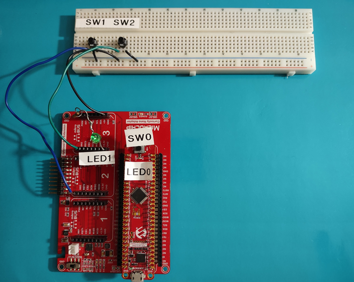</a>
## Setup

Attach the PIC18F57Q43 Curiosity nano to the Curiosity Nano adapter board with supplied pins. 
Place the Switches in the bread board. Connect one to AN2 and the other to AN3 on the Curiosity nano Adapter board. Connect the other pins of both switches to a Ground on the Curiosity nano adapter board.
You have a few choices to connect the LED and Resistor.  Solder the LED in series with the resistor and connect to PWM3 on the Curiosity nano adapter and the other to GND be sure to get the polarity of the LED correct, anode to the pin and the cathode towards GND. The second option is to place them into the breadboard and connect them in series with wires to the Curiosity nano adapter.
Connect the Curiosity nano to the PC. 

MCC with the Melody library was used to implement this example as shown in the following section.
## Clock Control Configuration
In the *Project Resources* window click Clock Control. 

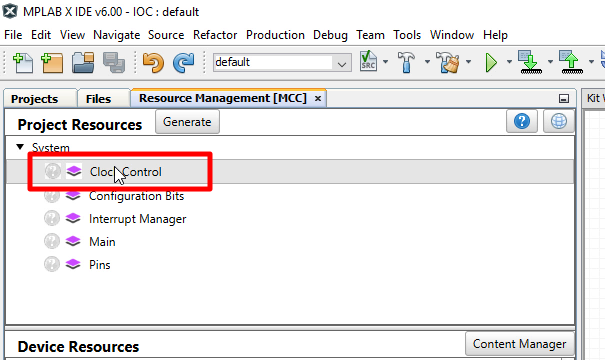

After selecting the "Clock Control" option, a window on the right side of the MPLAB-IDE will appear called *Clock Control Easy View*. Use the Dropdown boxes to select HFINTOSC, 4MHz, and divide by 4 as shown in the figure below.

## Pin Configuration
In the *Pins Grid View* find "RB4" for the input pin "SW0" select and "RF3" for the indicator "LED0" output. Select these pins by clicking the corresponding padlock symbol as shown in the figure below.

**Pins Grid View**

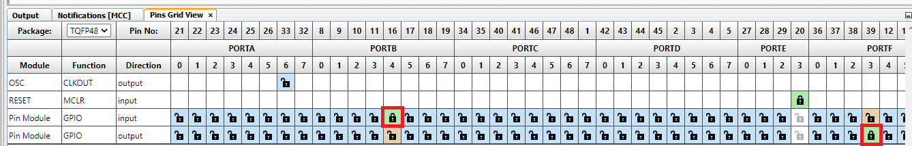

## Pin Control Configuration
In the *Project Resources* window selecting the "Pins" option.

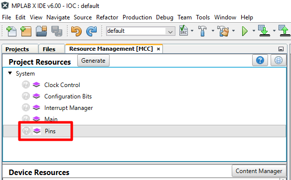

After selecting the "Pins" option, a window on the right side of the MPLAB-IDE will appear called "Pins". Slide the bar on the left side to view more of the window.
De-select the "Analog" checkbox on all pins in this window to disable analog functionality, which is not needed for this example. 

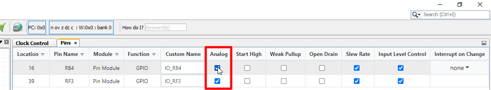

Use the "Custom Name" field to rename pin "RB4" to "SW0" and "RF3" to "LED0". 
Select the "Start High" option for pin RF3 (LED0), so that the LED does not light up until the button has been pushed.

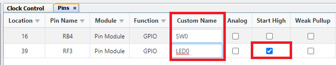

## IOC Configuration
Choose from dropdown arrow Negative Edge for IOC.

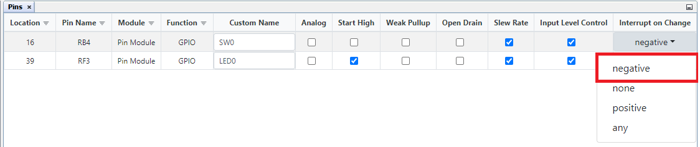

In the *Project Resources* window click the "Generate" button.

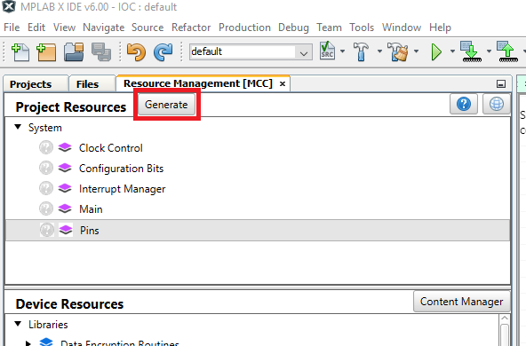

Next, copy the global interrupt enable from the interrupt.h file so it can use it in the main.c.

Add code to Light LED0 when the interrupt happens. Open pins.c in the source files. The code will go in the method called RB4_DefaultInterruptHandler() where it says add code here type LED0_SetLow(); as shown below

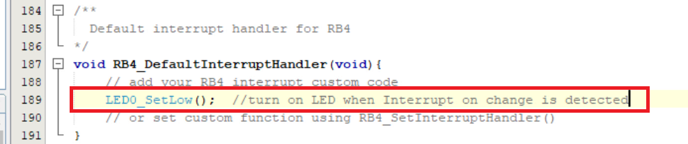

The next step is to open the main.c source file and to add code to do two things; enable global interrupts and to reset the LED when SW0 goes into its default state.
Copy the function called INTERRUPT_GlobalInterruptEnable(); and paste it into the main.c after SYSTEM_Initialize();

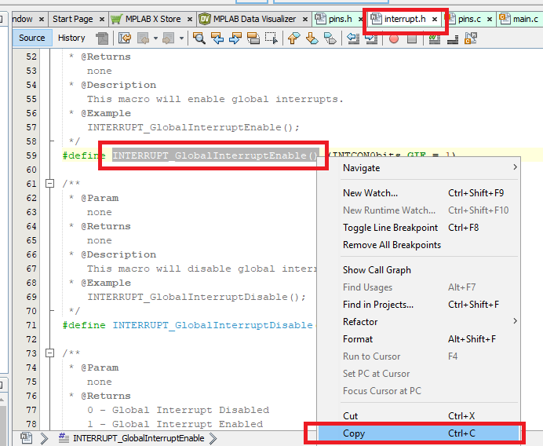

In addition to this, also copy the code snippet shown below into the main while(1) loop.

        __delay_ms(2000);
        LED0_SetHigh(); //turn off LED0 to wait for next interrupt

The main.c file should look this this after completing these steps: 
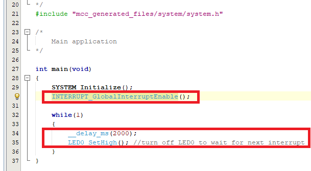

Click the "Clean and Build" button once the routine has been copied into the main loop.

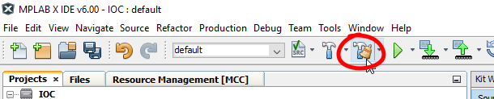

Once the project has been successfully built the output window should show the following message:

Click the "Program Device" button.

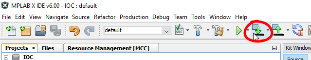

Once the device has been successfully programmed, the output window should show the following message:

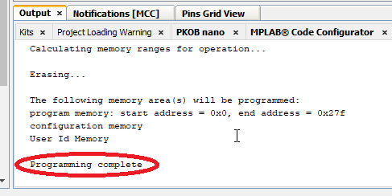
## Operation

To operate this demo, press the pushbutton named SW0. LED0 should light up for 2 seconds indicating that an interrupt-on-change has occurred (negative edge has been detected) and then the LED should shut off until a negative edge is detected on this pin again. .

</a>

## Summary

The example has shown how Melody can be used to easily configure a pin, using the Interrupt on Change feature of the GPIO module module of the PIC18F57Q43 device. 