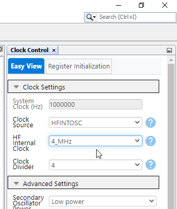

<!-- Please do not change this logo with link -->

# Update the title for pic18f57q43-cnano-ioc-mplab-melody here

<!-- This is where the introduction to the example goes, including mentioning the peripherals used -->

## Related Documentation

<!-- Any information about an application note or tech brief can be linked here. Use unbreakable links!
     In addition a link to the device family landing page and relevant peripheral pages as well:
     - [AN3381 - Brushless DC Fan Speed Control Using Temperature Input and Tachometer Feedback](https://microchip.com/00003381/)
     - [PIC18F-Q10 Family Product Page](https://www.microchip.com/design-centers/8-bit/pic-mcus/device-selection/pic18f-q10-product-family) -->

## Software Used

<!-- All software used in this example must be listed here. Use unbreakable links!
     - MPLAB® X IDE 5.30 or newer [(microchip.com/mplab/mplab-x-ide)](http://www.microchip.com/mplab/mplab-x-ide)
     - MPLAB® XC8 2.10 or a newer compiler [(microchip.com/mplab/compilers)](http://www.microchip.com/mplab/compilers)
     - MPLAB® Code Configurator (MCC) 3.95.0 or newer [(microchip.com/mplab/mplab-code-configurator)](https://www.microchip.com/mplab/mplab-code-configurator)
     - MPLAB® Code Configurator (MCC) Device Libraries PIC10 / PIC12 / PIC16 / PIC18 MCUs [(microchip.com/mplab/mplab-code-configurator)](https://www.microchip.com/mplab/mplab-code-configurator)
     - Microchip PIC18F-Q Series Device Support (1.4.109) or newer [(packs.download.microchip.com/)](https://packs.download.microchip.com/) -->

- MPLAB® X IDE 6.0.0 or newer [(MPLAB® X IDE 6.0)](https://www.microchip.com/en-us/development-tools-tools-and-software/mplab-x-ide?utm_source=GitHub&utm_medium=TextLink&utm_campaign=MCU8_MMTCha_MPAE_Examples&utm_content=pic18f57q43-cnano-ioc-mplab-melody-github)
- MPLAB® XC8 2.35.0 or newer compiler [(MPLAB® XC8 2.35)](https://www.microchip.com/en-us/development-tools-tools-and-software/mplab-xc-compilers?utm_source=GitHub&utm_medium=TextLink&utm_campaign=MCU8_MMTCha_MPAE_Examples&utm_content=pic18f57q43-cnano-ioc-mplab-melody-github)

## Hardware Used

<!-- All hardware used in this example must be listed here. Use unbreakable links!
     - PIC18F47Q10 Curiosity Nano [(DM182029)](https://www.microchip.com/Developmenttools/ProductDetails/DM182029)
     - Curiosity Nano Base for Click boards™ [(AC164162)](https://www.microchip.com/Developmenttools/ProductDetails/AC164162)
     - POT Click board™ [(MIKROE-3402)](https://www.mikroe.com/pot-click) -->
- [Microchip PIC18F57Q43 Curiosity Nano Evaluation Kit](https://www.microchip.com/developmenttools/ProductDetails/DM164150)
- [Microchiop Curiosity Nano Base for Click boards](https://www.microchip.com/developmenttools/ProductDetails/AC164162)

### Hardware User Guide

This example code will show how to setup the microcontroller to interrupt when it sees a change on the specified pin. RF3 will be the indicator for the interrupt and RB4 for the SW0 on the Curiosity nano to change the state of the pin.

To be able to read the value we would have to configure the Pin for interrupt on change and using a negative edge since SW0 is active low.  

  
</a>
## Setup

<!-- Explain how to connect hardware and set up software. Depending on complexity, step-by-step instructions and/or tables and/or images can be used -->
MCC with the Melody library was used to implement this example as shown in the following section.
## Clock Control Configuration
In the *Project Resources* window click Clock Control. 

A window on the right side of the MPLAB-IDE will appear called *Clock Control Easy View* use the Dropdown boxes to select HFINTOSC, 4MHz, and devide by 4.

## Pin Configuration
In the *Pins Grid View* find ANx for the input pin to the ADC module. AN1 coming from the Click 1 postition is connected to RA0. selected as an output by clicking the corresponding padlock symbol.

**Pins Grid View**

## Pin Control Configuration
In the *Project Resources* window click Pins. 

A window on the right side of the MPLAB-IDE will appear called pins slide the bar on the left side to view more of the window. 
De-select analog. 

Rename RB4 to SW0 and RF3 to LED0. Start high for LED0 so it doesn't light till the interrupt. 

## IOC Configuration
Choose from dropdown arrow Negative Edge for IOC.

In the *Project Resources* window click Generate.

Next, copy the global interrupt enable from the interrupt.h file so it can use it in the main.c.

Add code to Light LED0 when the interrupt happens. Open pins.c in the source files. The code will go in the method called RB4_DefaultInterruptHandler() where it says add code here type LED0_SetLow(); as shown below

Then we will want to open Main.c to add code to do two things enable global interrupts and to reset the led when the SW0 goes to its default state.
Paste INTERRUPT_GlobalInterruptEnable(); into the Main.c after SYSTEM_Initialize();

Click Clean and Build button.

Success!!

Click Program Device button.

Success!!

## Operation

<!-- Explain how to operate the example. Depending on complexity, step-by-step instructions and/or tables and/or images can be used -->
Push SW0 and see if the LED0 lights for 2 seconds and then shuts off till the next interrupt.

</a>

## Summary

<!-- Summarize what the example has shown -->
The example has shown how Melody can be used to easily configure a pin, using the Interrupt on Change feature of the GPIO module module of the PIC18F57Q43 device. 